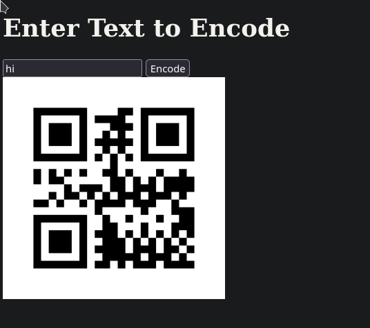

# qrecode app


app for encoding text.

# How to run
1. run build
```bash
docker compose up --build
```
2. go to `localhost:8000`


# TODO
- [ ] improve styles
- [ ] extract qrecoding in other process
